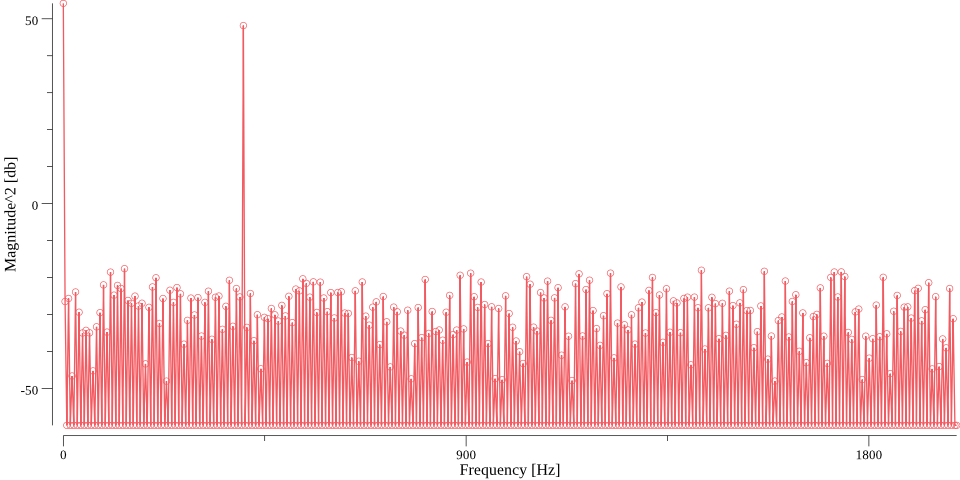

# Fourier-ADC
Dynamic properties of Analog-Digital Converter calculator written in golang!

```commandline
$ ./Fourier-ADC --help

Usage of ./Fourier-ADC:
  -dftlen int
        Length of the DFT. (default 1024)
  -fsam float
        Sampling frequency.
  -fsig float
        Original signal frequency.
  -input string
        Input file path.

```

Example Output:
```commandline
$ ./Fourier-ADC --dftlen 1024 --input data/example_data.csv --fsig 402.34375 --fsam 4000

Starting
Reading data from data/example_data.csv 
Read 1024 points
+-----------+----------+---------+---------+
| FSIG [HZ] | FS [HZ]  | DFT LEN | FB [HZ] |
+-----------+----------+---------+---------+
|   402.344 | 4000.000 |    1024 |   3.906 |
+-----------+----------+---------+---------+
Calculated DFT in 5.825837ms.
Plot save in data/example_data.png
Signal index: 103
DFT len : 1024
Aliased harmonics indices [103 206 309 412 509 406 303 200 97 6]
Aliased harmonics freqs [402 805 1.21e+03 1.61e+03 1.99e+03 1.59e+03 1.18e+03 781 379 23.4]

+----------+-----------+-----------+------------+-------------+
| THD [DB] | SNHR [DB] | SFDR [DB] | SINAD [DB] | ENOB [BITS] |
+----------+-----------+-----------+------------+-------------+
|  -72.792 |    50.011 |    65.768 |     49.988 |       8.011 |
+----------+-----------+-----------+------------+-------------+

```


